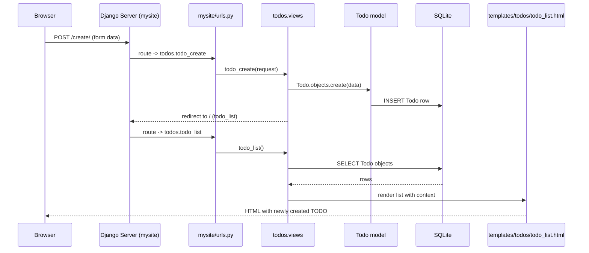
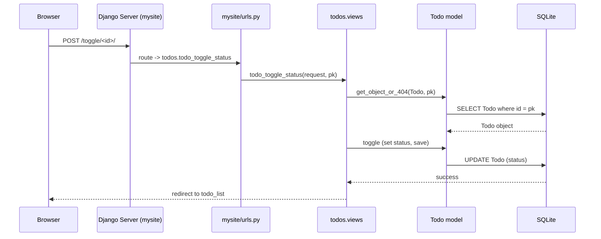
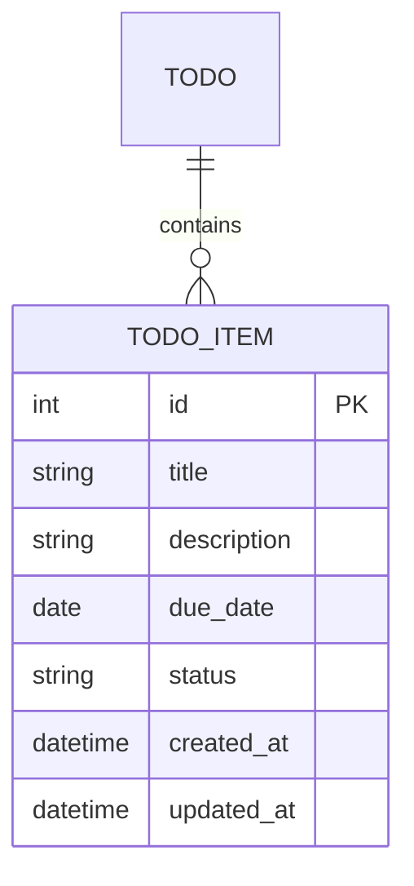

# Project Design Diagrams (Mermaid)

This file contains simple, easy-to-read architecture and flow diagrams for the `myDjangoProject` application using Mermaid syntax. You can view these diagrams in editors that support Mermaid (VS Code with Mermaid preview, GitHub Markdown preview, or Mermaid live editor).

---

## Component Diagram (System Architecture)

```mermaid
flowchart TB
  Browser[User Browser] -. HTTP/WS -> Gateway[WSGI/ASGI (mysite.wsgi/asgi)]
  subgraph Django[mysite Django Project]
    direction TB
    URLs[mysite/urls.py]
    Settings[mysite/settings.py]
    subgraph Apps
      Todos[todos app]
      Blog[blog app]
    end
    Templates[todos/templates] 
    Admin[Django Admin]
    Migrations[migrations]
    Tests[tests]
  end

  DB[SQLite DB: db.sqlite3]
  GitHub[GitHub Repo (myDjangoProject)]
  CI[GitHub Actions CI]

  Browser --> Gateway
  Gateway --> URLs
  URLs --> Todos
  Todos --> Templates
  Todos --> DB
  Todos --> Admin
  Todos --> Migrations
  Todos --> Tests
  Todos --> GitHub
  GitHub --> CI
  CI --> Tests

  style Django fill:#f9f,stroke:#333,stroke-width:2px
  style Todos fill:#bbf
  style DB fill:#ffb
  style GitHub fill:#ddd
```

---

## Sequence (Create a TODO)



---

## Sequence (Toggle TODO status)



---

## Model (ERD) — Todo



> Note: The Todo model in `todos/models.py` uses `db_table = 'TODO_todo'` in its `Meta`, `status` values are `pending|resolved` and ordering by `-created_at`.

---

## How to use these diagrams
- Open `docs/diagram.md` in an editor that supports Mermaid preview (e.g., VS Code Mermaid extension) to view visuals.
- The Component Diagram helps you locate code and understand inter-app relationships.
- The Sequence Diagrams walk through typical user flows — useful for validating tests or building E2E tests.
- The ERD helps understand model fields and simple schema relationships.

---

## Next Suggestions
- Add a `docs/architecture.md` file to document API routes and more detailed responsibilities of views.
- Convert diagrams to PNG/SVG if you need to embed them in other documentation or GitHub README.
- Add a `devcontainer` to reproduce dev environment in GitHub Codespaces.

---

Generated for `myDjangoProject` — feel free to request additional diagrams or exports.
